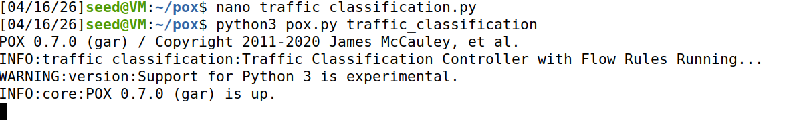
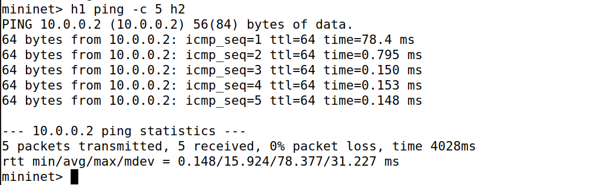
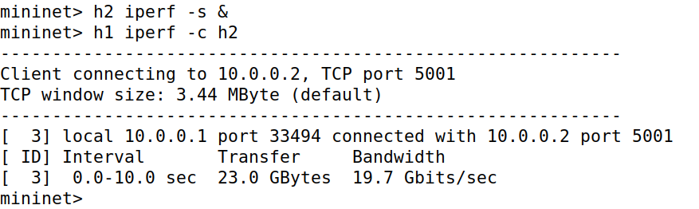
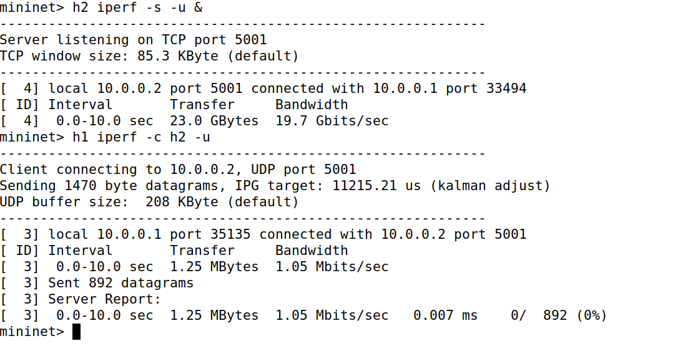
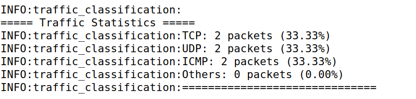
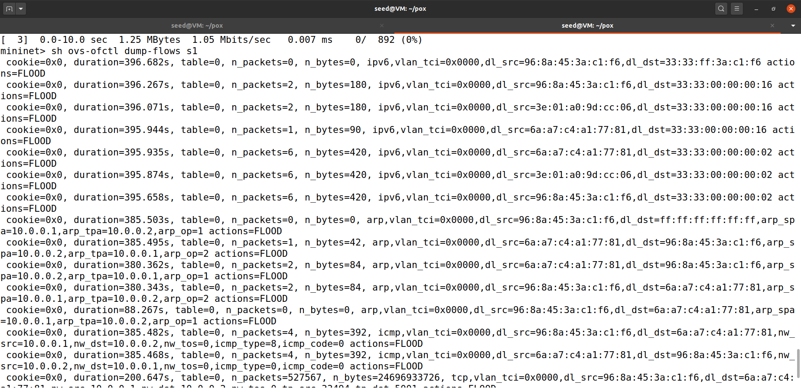

# SDN Traffic Classification System

## 1. Problem Statement

The objective of this project is to design and implement a Software Defined Networking (SDN) based solution using Mininet and a POX controller. The system classifies network traffic based on protocol type (TCP, UDP, ICMP), maintains statistics, and analyzes traffic distribution. The project demonstrates controller–switch interaction, flow rule design using OpenFlow, and network behavior observation.

---

## 2. Tools and Technologies Used

* Mininet (Network Emulator)
* POX Controller
* OpenFlow Protocol
* Ubuntu 20.04 (SEED VM)

---

## 3. System Design and Approach

### 3.1 Architecture

* Mininet is used to simulate a virtual network consisting of hosts and switches.
* The POX controller acts as the control plane.
* The OpenFlow switch communicates with the controller using PacketIn messages.

### 3.2 Controller Logic

* The controller listens for PacketIn events.
* It extracts packet information and identifies the protocol using IP headers:

  * TCP → Protocol 6
  * UDP → Protocol 17
  * ICMP → Protocol 1
* Packet counts are maintained for each protocol.
* Flow rules are installed using OpenFlow match-action logic to handle future packets efficiently.

---

## 4. Setup and Execution Steps

### Step 1: Run the POX Controller

```bash
cd pox
python3 pox.py traffic_classification
```

### Step 2: Start Mininet

```bash
sudo mn --topo single,3 --controller remote
```

---

## 5. Testing and Validation

### 5.1 Scenario 1: Protocol Classification

#### ICMP Traffic

```bash
h1 ping -c 5 h2
```

#### TCP Traffic

```bash
h2 iperf -s &
h1 iperf -c h2
```

#### UDP Traffic

```bash
h2 iperf -s -u &
h1 iperf -c h2 -u
```

**Observation:**

* ICMP generates request and reply packets.
* TCP traffic dominates during iperf execution.
* UDP traffic is correctly classified using protocol number 17.

---

### 5.2 Scenario 2: Traffic Behavior Analysis

* Low traffic (ICMP) produces fewer packets.
* High traffic (TCP/UDP via iperf) produces a larger number of packets.
* The controller dynamically updates statistics based on traffic load.

---

## 6. Expected Output

* Controller logs display packet classification results.
* Statistics include packet counts and percentage distribution.
* Flow rules are installed in the switch after initial packet processing.
* Network operates efficiently after flow rule installation.

---

## 7. Proof of Execution

### 7.1 Controller Initialization



---

### 7.2 ICMP Traffic (Ping Test)



---

### 7.3 TCP Traffic (iperf Test)



---

### 7.4 UDP Traffic (iperf Test)



---

### 7.5 Controller Output (Traffic Statistics)



---

### 7.6 Flow Table (OpenFlow Rules)



---

## 8. Analysis and Observations

* Each ICMP ping generates two packets (request and reply).
* TCP and UDP traffic produce multiple packets due to continuous data transmission.
* Flow rules installed in the switch reduce repeated controller involvement.
* The system demonstrates efficient separation of control and data planes.

---

## 9. Conclusion

The project successfully demonstrates SDN principles including centralized control, traffic classification, and flow rule installation. The use of Mininet and POX enables realistic simulation of network behavior without physical hardware. The system effectively classifies traffic and dynamically adapts to network conditions.

---

## 10. References

1. Mininet Documentation: https://mininet.org/
2. POX Controller Repository: https://github.com/noxrepo/pox
3. OpenFlow Specification
